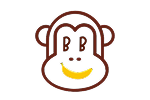

# BB Boost - JavaFX Desktop App

## Overview

**BB Boost** is a desktop application designed to support college students in managing their mental and emotional well-being through daily affirmations, mood check-ins, and journaling. The app provides a simple, personalized, and engaging experience to help students combat stress, stay motivated, and track their mental health over time.

---

## Features

- 📝 **Journaling**: Record, view, edit, and delete your journal entries.
- 😊 **Mood Check-ins**: Log your current mood and reflect on your emotional trends.
- 💬 **Affirmations**: Receive random, uplifting messages to boost your mood.
- 📊 **Dashboard**: See your overall activity and history in one place.
- 🔄 **Reset Options**: Reset all or specific app data with confirmation prompts.

---

## Getting Started

### Requirements

- Java JDK 17 or later
- JavaFX 21 LTS SDK (if running from source)
- Compatible OS: Windows, macOS, or Linux

---

## Run the App (Executable JAR)

### 1. Download the JAR file

You can download the latest BB Boost `.jar` file from the following link:

📁 [Download BB Boost JAR](https://drive.google.com/drive/folders/1MI6WRhQzE4E-4d0iKJh2MhasQLPfY_DV?usp=drive_link)

### 2. Open a Terminal/Command Prompt

Navigate to the directory where the JAR file is downloaded and run.
